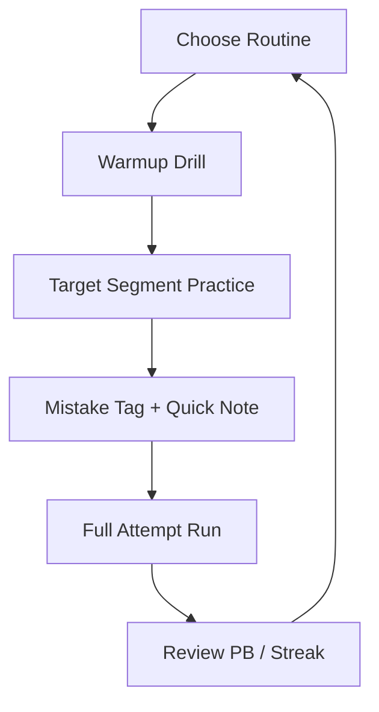

# BALL x PIT Trainer 

Sometimes the hardest part isn’t the pit—it’s the *second-guessing*. That half-breath before a jump, the tiny tilt that turns a clean roll into a ricochet. **BALL x PIT Trainer** is a practice-first software companion for players who want to understand the game’s physics instead of merely surviving them.

This trainer is built for **single-player improvement**: structured drills, repeatable warmups, and smart tracking that help you sharpen control over speed, angles, timing, and recovery. It’s not about skipping the journey. It’s about learning the language of motion until it starts speaking back in confidence.

---

## 🎯 What This Trainer Helps You Improve

BALL x PIT’s physics are simple to describe and tricky to *own*. The trainer focuses on the most common “failure points” and turns them into bite-sized routines:

* **Angle discipline** (approach lines, edge commitment, exit direction)
* **Speed management** (how much momentum you truly need, not how much you *feel*)
* **Bounce predictability** (controlling rebound height and drift)
* **Micro-corrections** (tiny adjustments without oversteering)
* **Recovery habits** (resetting after a bad touch without spiraling)

If you’ve ever said “That should’ve worked,” this tool is for you. It shows you *why* it didn’t—and how to make it work next time.

---

## 🧩 Features

### ⏱ Drill Library (Warmups + Targeted Practice)

Choose routines by goal and time:

* **5-Minute Hands-On Warmup** (gentle control, low intensity)
* **10-Minute Momentum Control** (ramps, slopes, speed gates)
* **15-Minute Precision Circuit** (tight edges, short landings, recovery)

Each drill includes:

* Clear objective
* Suggested number of attempts
* A simple metric (completion streak, time window, error count)

### 📍 Segment Practice & Checkpoint Planning

Create your own “practice slices”:

* Save a **problem segment** (e.g., “ramp into pit chain”)
* Repeat it with controlled attempt counts
* Add quick notes like “enter slower” or “stay left on exit”

### 🧠 Mistake Tags (So You Stop Repeating Them)

After a fail, tag it quickly:

* Over-speed
* Under-commit
* Late correction
* Bad entry line
* Panic steer

Over time, patterns emerge. The trainer doesn’t judge—you’ll do enough of that yourself—it simply reflects.

### 🗺 Route Notes & Personal Best Tracking

For each level:

* Store preferred route choice
* Save “risky vs safe” alternatives
* Track PBs and “clean run” streaks

### 🎛 Presets for Practice Modes

While the trainer is not about “breaking” the game, it **does** support optional practice presets that make learning smoother:

* Slow motion rehearsal (for timing study)
* Assisted retry flow (faster iteration loops)
* Camera and UI notes for capture practice

[!IMPORTANT]
Use practice presets as **training wheels**: learn the movement, then return to default settings for your honest clears.

---

## ⚡ Setup

BALL x PIT Trainer can be used as a **checklist-only routine** or as a **small local companion app** (depending on how you implement/distribute it in your project).

### Option A: Checklist Mode (No App Needed)

1. Open this README during play
2. Pick a routine (5/10/15 minutes)
3. Track metrics in a note (streaks + mistake tags)

### Option B: Local Companion App (Recommended)

1. Download the trainer build
2. Extract to a folder you control (e.g., `Documents/BALLxPIT-Trainer`)
3. Launch the trainer
4. Create a profile for your input style (keyboard/controller)
5. Pick a routine and start a session timer

Example config file:

```yaml
profile: "Precision+Recovery"
session_length_minutes: 15
drills:
  - name: "Angle Lines"
    attempts: 12
    metric: "clean_entries"
  - name: "Momentum Gates"
    attempts: 10
    metric: "speed_control_errors"
  - name: "Bounce Chains"
    attempts: 8
    metric: "overshoot_count"
notes:
  camera: "slightly zoomed out"
  reminder: "commit earlier on ramps"
```

[!NOTE]
The best configuration is the one you’ll actually repeat. Make it small. Make it doable. Then keep it sacred.

---

## 🧠 Training Flow Diagram



This loop is the point: short focus, honest attempts, quick reflection, repeat.

---

## 🧪 Ready-to-Run Routines

### 5 Minutes — “Smooth Hands”

* 2 minutes: slow roll and stop control (no sharp turns)
* 2 minutes: edge approach practice (commit without wobble)
* 1 minute: three “clean attempts” in a row

**Metric:** *wobble count* (how often you overcorrect)

### 10 Minutes — “Momentum Sense”

* 4 minutes: ramps at different entry speeds (note which one is optimal)
* 3 minutes: slope recovery (fix the line after a bad touch)
* 3 minutes: two full tries with one rule: *no panic steer*

**Metric:** *overshoot vs undershoot ratio*

### 15 Minutes — “Precision Circuit”

* 5 minutes: tight corner entries
* 5 minutes: bounce chain control
* 5 minutes: full segment attempts with tags + notes

**Metric:** *clean streak* (how many attempts feel “in control,” even if not perfect)

---

## ❓ FAQ

**Is BALL x PIT Trainer a cheat?**
No. It’s a training utility focused on routines, notes, and measurable improvement. Optional practice presets exist to help you learn mechanics, but the goal is mastery—not bypassing gameplay.

**Will this make me better quickly?**
You’ll usually feel steadier within a week if you train 10–15 minutes consistently. The bigger gain is *less tilt*: fewer “mystery fails,” more intentional runs.

**What should I track if I hate statistics?**
Track just two things: (1) your best clean streak, and (2) your most common mistake tag. That’s enough.

**How do I avoid overtraining?**
Stop when your hands get noisy—when every correction becomes bigger than it needs to be. End on a clean drill, not on frustration.

**Can I use it for speedruns?**
Yes—especially the segment practice and route notes. It helps you test lines, then commit to the best one.

---

## 🌘 Final Thoughts

BALL x PIT rewards a particular kind of bravery: not the loud kind, but the quiet kind—the kind that keeps rolling after the tenth miss because you learned something on the ninth. **BALL x PIT Trainer** is there for that learning: a small, steady companion that turns chaos into patterns, patterns into habits, and habits into clean clears.

When the ball finally glides through a sequence that used to terrify you, you’ll feel it—not like luck, but like ownership. The pit will still be there. But you’ll be different.

---
